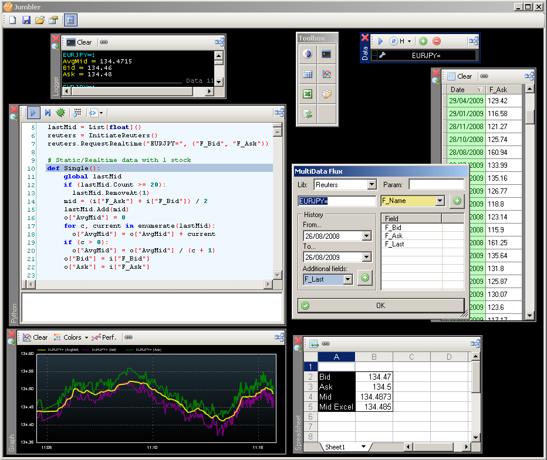
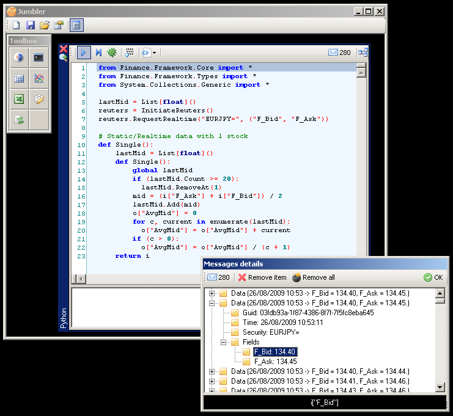

# Economiyaki
Financial library that combines Winforms elements &amp; market access mods to simplify / unify data retrieval from Bloomberg or Reuters. A mash-up tool is included with which the user is able to mix &amp; link these elements between each other (called Jumbler). The whole system is also scriptable with IronPython. 

Note: Bloomberg or/and Reuters is needed to actually use this application, but you could develop a little module to get data from another data access provider.

# Screenshots

